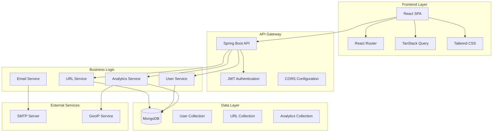
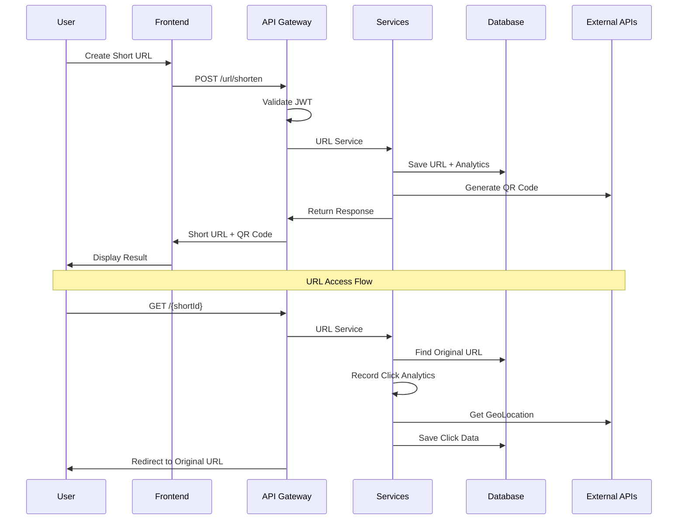

# 🚀 URL Shortener - Complete System

A comprehensive full-stack URL shortening system with advanced features, user management, detailed analytics, and modern interface.

## 🎯 Project Overview

This is a complete full-stack system for URL shortening that goes far beyond a simple shortener. It offers professional features like detailed analytics, user system with different plans, secure authentication, and a modern responsive interface.

## 🏗️ System Architecture



## 🛠️ Technology Stack

### Backend Technologies

| Technology | Version | Purpose |
|------------|---------|---------|
| **Java** | 21+ | Main programming language |
| **Spring Boot** | 3.5.0 | Framework and auto-configuration |
| **Spring Security** | 6.x | Authentication and authorization |
| **Spring Data MongoDB** | 4.x | Database abstraction layer |
| **MongoDB** | 7.x | NoSQL database |
| **JWT** | 4.5.0 | Token-based authentication |
| **Swagger/OpenAPI** | 3.0 | API documentation |
| **JavaMail** | 2.x | Email service integration |
| **Thymeleaf** | 3.x | Email template engine |
| **GeoIP2** | 4.3.1 | Geographic location service |
| **Lombok** | 1.18.x | Code generation |

### Frontend Technologies

| Technology | Version | Purpose |
|------------|---------|---------|
| **React** | 19.1.0 | UI framework |
| **TypeScript** | 5.8.3 | Type-safe JavaScript |
| **Vite** | 6.3.5 | Build tool and dev server |
| **React Router** | 7.6.2 | Client-side routing |
| **TanStack Query** | 5.80.7 | Server state management |
| **Tailwind CSS** | 3.4.17 | Utility-first CSS |
| **Radix UI** | Latest | Accessible component primitives |
| **React Hook Form** | 7.58.0 | Form management |
| **Zod** | 3.25.67 | Schema validation |
| **Recharts** | 2.15.3 | Chart components |
| **Lucide React** | 0.516.0 | Icon library |

## 📁 Project Structure

```
url-shortener/
├── urlshortener/                     # Backend (Spring Boot)
│   ├── src/main/java/
│   │   └── desafiourl/urlshortener/
│   │       ├── config/               # Configuration classes
│   │       │   ├── SecurityConfig.java
│   │       │   ├── CorsConfig.java
│   │       │   └── JwtAuthenticationFilter.java
│   │       ├── controller/           # REST controllers
│   │       │   ├── UrlController.java
│   │       │   ├── AuthController.java
│   │       │   ├── UserController.java
│   │       │   └── AnalyticsController.java
│   │       ├── service/              # Business logic
│   │       │   ├── UrlService.java
│   │       │   ├── UserService.java
│   │       │   ├── EmailService.java
│   │       │   └── AnalyticsService.java
│   │       ├── entities/             # Data models & DTOs
│   │       │   ├── UserEntity.java
│   │       │   ├── UrlEntity.java
│   │       │   ├── ClickEntity.java
│   │       │   └── dto/
│   │       ├── repository/           # Data access layer
│   │       │   ├── UserRepository.java
│   │       │   ├── UrlRepository.java
│   │       │   └── ClickRepository.java
│   │       ├── utils/                # Utility classes
│   │       │   ├── JwtUtils.java
│   │       │   └── ValidationUtils.java
│   │       └── exception/            # Exception handling
│   │           └── GlobalExceptionHandler.java
│   ├── src/main/resources/
│   │   ├── templates/                # Email templates
│   │   │   ├── email-verification.html
│   │   │   ├── password-reset.html
│   │   │   └── welcome.html
│   │   └── application.yml           # Configuration file
│   └── pom.xml                       # Maven dependencies
│
└── url-shortener-frontend/          # Frontend (React)
    ├── src/
    │   ├── components/               # Reusable components
    │   │   ├── ui/                   # Base UI components
    │   │   ├── layout/               # Layout components
    │   │   ├── forms/                # Form components
    │   │   ├── analytics/            # Analytics components
    │   │   └── display/              # Display components
    │   ├── pages/                    # Page components
    │   │   ├── public/               # Public pages
    │   │   │   ├── Home.tsx
    │   │   │   ├── Login.tsx
    │   │   │   └── Register.tsx
    │   │   └── private/              # Protected pages
    │   │       ├── Dashboard.tsx
    │   │       ├── Analytics.tsx
    │   │       └── Profile.tsx
    │   ├── hooks/                    # Custom React hooks
    │   │   ├── useAuth.ts
    │   │   ├── useAnalytics.ts
    │   │   └── useUrls.ts
    │   ├── services/                 # API communication
    │   │   ├── api.ts
    │   │   ├── auth.service.ts
    │   │   └── url.service.ts
    │   ├── types/                    # TypeScript definitions
    │   │   ├── auth.types.ts
    │   │   ├── url.types.ts
    │   │   └── analytics.types.ts
    │   ├── lib/                      # Utilities
    │   │   ├── utils.ts
    │   │   └── validations.ts
    │   └── config/
    │       └── api.ts                # API configuration
    ├── public/                       # Static assets
    ├── package.json                  # Dependencies
    └── vite.config.ts               # Vite configuration
```

## 🔄 Data Flow Architecture



## ✨ Core Features

### 🔐 Complete Authentication System
- **User Registration** with email validation
- **Secure Login** with JWT tokens
- **Email Verification** mandatory system
- **Password Recovery** via email
- **User Profile** management
- **Password Change** with validation

### 🔗 Advanced URL Management
- **URL Shortening** with unique IDs
- **Custom Aliases** (personalized short URLs)
- **Configurable Expiration** for URLs
- **Private URLs** (user-linked)
- **Smart Redirection** with tracking
- **Automatic QR Code** generation

### 📊 Comprehensive Analytics
- **Real-time Click Statistics**
- **Geographic Analysis** of visitors
- **Device and Browser** analytics
- **Traffic Sources** (referrers)
- **Click Timeline** with charts
- **Personalized Dashboard** per user

### 👥 User Management & Plans
- **FREE Plan**: Basic limitations
- **PREMIUM Plan**: Advanced features
- **Monthly Quota** control
- **Custom Statistics** per user
- **Complete Profile** management

### 🛡️ Security & Quality
- **Malicious URL** validation
- **Rate Limiting** per IP
- **Security Headers** configured
- **Robust Data** validation
- **Detailed Activity** logs
- **Professional Error** handling

### 🎨 Modern Interface
- **Responsive Design** for all devices
- **Light/Dark Theme** support
- **Smooth Animations** and transitions
- **Real-time Visual** feedback
- **Intuitive Navigation** with sidebar
- **Reusable Components**

## 🚀 Getting Started

### Prerequisites

- **Java 21+**
- **Node.js 18+**
- **MongoDB** (local or Atlas)
- **Git**

### Backend Setup

```bash
# Clone the repository
git clone <repository-url>
cd url-shortener/urlshortener

# Run the application
./mvnw spring-boot:run
```

The API will be available at `http://localhost:8080`

### Frontend Setup

```bash
# Navigate to frontend directory
cd url-shortener-frontend

# Install dependencies
npm install

# Start development server
npm run dev
```

The application will be available at `http://localhost:5173`

## ⚙️ Configuration

### Backend Configuration

Create `application.yml` with the following structure:

```yaml
spring:
  data:
    mongodb:
      uri: mongodb://localhost:27017/urlshortener
  mail:
    host: smtp.gmail.com
    port: 587
    username: ${EMAIL_USERNAME}
    password: ${EMAIL_PASSWORD}
    properties:
      mail:
        smtp:
          auth: true
          starttls:
            enable: true

app:
  jwt:
    secret: ${JWT_SECRET}
    expiration: 86400000
  url:
    base-url: http://localhost:8080
  frontend:
    url: http://localhost:5173
```

### Frontend Configuration

Create `.env` file:

```bash
VITE_API_BASE_URL=http://localhost:8080
VITE_APP_NAME=URLShortener
```

## 📚 API Documentation

### Authentication Endpoints

```http
POST   /api/auth/register          # Register user
POST   /api/auth/login             # User login
POST   /api/auth/verify-email      # Email verification
POST   /api/auth/forgot-password   # Forgot password
POST   /api/auth/reset-password    # Reset password
```

### URL Management

```http
POST   /url/shorten               # Shorten URL
GET    /{id}                      # Redirect to original
GET    /api/urls/my-urls          # List user URLs
GET    /api/urls/{id}/stats       # URL statistics
PUT    /api/urls/{id}             # Update metadata
DELETE /api/urls/{id}             # Delete URL
```

### Analytics

```http
GET    /api/analytics/url/{id}              # Complete analytics
GET    /api/analytics/url/{id}/clicks       # Click list
GET    /api/analytics/url/{id}/stats/geo    # Geographic stats
GET    /api/analytics/url/{id}/stats/devices # Device stats
```

### User Management

```http
GET    /api/user/profile          # User profile
PUT    /api/user/profile          # Update profile
PUT    /api/user/change-password  # Change password
GET    /api/user/stats            # User statistics
```

## 📊 Analytics Features

The system provides comprehensive analytics including:

- **Real-time Clicks**: Instant access counting
- **Geographic Location**: World map of click origins
- **Temporal Analysis**: Charts by hour/day/month
- **Device Types**: Desktop, mobile, tablet
- **Browsers**: Chrome, Firefox, Safari, Edge, etc.
- **Operating Systems**: Windows, macOS, Linux, iOS, Android
- **Traffic Sources**: Social media, organic search, direct

## 🔒 Security Implementation

- **CORS** configured for authorized origins only
- **Input Validation** on all endpoints
- **Rate Limiting** to prevent abuse
- **Data Sanitization** against XSS
- **JWT with Expiration** configurable
- **Encrypted Passwords** with BCrypt
- **Security Headers** (CSP, HSTS, etc.)

## 🎨 UI/UX Features

- **Consistent Design System** with reusable components
- **Complete Responsiveness** (mobile-first)
- **Loading States** in all operations
- **Error Boundaries** for error capture
- **Toast Notifications** for feedback
- **Smart Forms** with real-time validation
- **Fluid Navigation** without page reloads

## 🔮 Future Enhancements

### Planned Features
- [ ] **Advanced Caching** with Redis
- [ ] **Sophisticated API Rate Limiting**
- [ ] **Automated Testing** (Jest + JUnit)
- [ ] **CI/CD Pipeline** with GitHub Actions
- [ ] **Monitoring** with metrics and logs
- [ ] **Third-party Integration** API
- [ ] **Bulk URL Operations** (import/export)
- [ ] **Advanced User Roles** and permissions
- [ ] **URL Categories** and tags
- [ ] **Custom Domains** support

## 🤝 Contributing

This project demonstrates a complete and professional implementation of a URL shortening system, serving as a reference for modern full-stack architectures.

### Development Guidelines

1. **Backend**: Follow Spring Boot best practices
2. **Frontend**: Use TypeScript and component composition
3. **Database**: Optimize MongoDB queries and indexes
4. **Security**: Implement security-first approach
5. **Testing**: Write comprehensive tests
6. **Documentation**: Keep API documentation updated

## 📄 License

This project is open source and available under the [MIT License](LICENSE).


